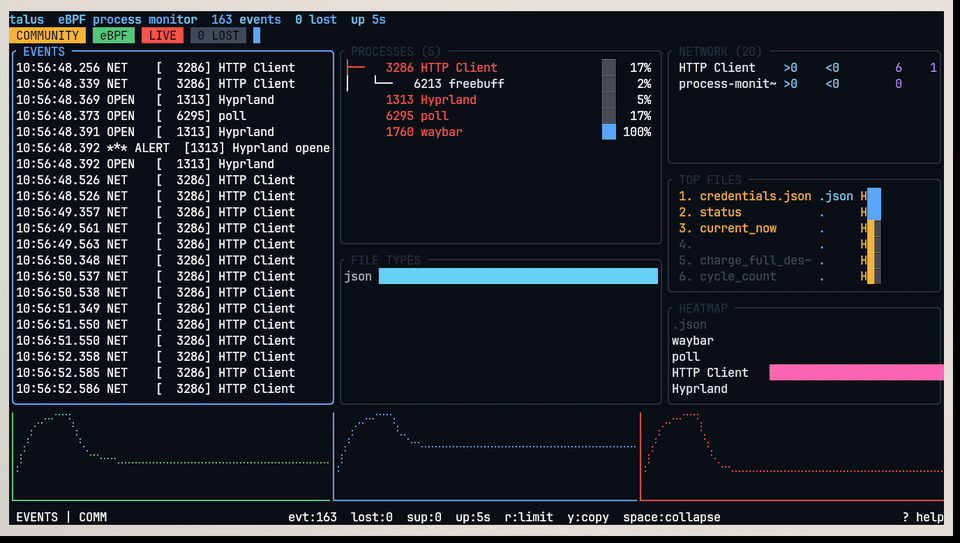

# 🛡️ Talus — Endpoint Security Agent


**eBPF-based endpoint security agent for Linux — detect ransomware behaviour, respond at the kernel edge.**

Talus is not a passive monitor. It is a **detect-and-respond** agent that hooks syscalls at the kernel level via eBPF tracepoints, scores per-process file-open rates in real-time, and **terminates** offending processes the instant a heuristic verdict fires. It processes ~500k events/sec through per-CPU perf buffers with zero-copy handoff to a userspace detection engine built in Rust.

> 🇵🇱 [Wersja polska](README.pl.md) · [Architecture](ARCHITECTURE.md) · [📄 Enterprise Report (PDF)](docs/talus-enterprise-maturity-report.pdf) · [Enterprise Maturity](MATURITY.md)

---

## Table of Contents

- [What It Does](#what-it-does)
- [Architecture / Data Flow](#architecture--data-flow)
- [Network Visibility](#network-visibility)
- [Detection & Response](#detection--response)
- [Storage & Pipeline](#storage--pipeline)
- [Requirements](#requirements)
- [Quick Start](#quick-start)
- [Usage](#usage)
- [Build Variants](#build-variants)
- [TUI Controls](#tui-controls)
- [Web Dashboard](#web-dashboard)
- [Operator View (TUI + Web)](#operator-view-tui--web)
- [Project Structure](#project-structure)
- [Tested Live on Linux](#tested-live-on-linux)
- [Docker / Kubernetes](#docker--kubernetes)
- [Security & Hardening](#security--hardening)
- [License](#license)

---

## What It Does

| Capability | How |
|---|---|
| **Kernel-level tracing** | eBPF tracepoints on `execve`, `openat`, `connect`, `accept`, `sendto`, `recvfrom`, `mkdir`, `unlinkat`, `kill`, `fchmodat` |
| **Ransomware detection** | 1-second sliding window per PID; alerts when file-open rate exceeds configurable threshold |
| **Automated response** | `--auto-kill` sends `SIGKILL` to the offending process on alert verdict |
| **Network egress tracking** | Parses `sockaddr` in-kernel — captures IPv4/IPv6/Unix addresses on connect/accept/send/recv |
| **Event pipeline** | Kernel perf buffer → zero-copy ring → detection engine → TUI / JSON / WebSocket / Prometheus |
| **Process tree** | Resolves PPID from `/proc`, builds hierarchical view with per-process alert counts |
| **File ranking** | Most-opened files with Shannon entropy scoring (detects encrypted/randomised filenames) |
| **Single binary** | Full LTO, `panic = "abort"`, symbol-stripped — 1.7 MB TUI, 2.5 MB with web |
| **Kafka streaming** | Events → Kafka topics with lz4 compression, partitioned by PID |
| **ClickHouse storage** | Batch inserts into MergeTree for analytics retention |
| **MemGraph graph** | Process trees + file access as a graph (Cypher queries) |

---

## Architecture / Data Flow

Talus follows a **pipeline architecture** — kernel ingestion → userspace detection → operator response:

```
┌─────────────────────────────────────────────────────────────────────────┐
│                      KERNEL SPACE (eBPF programs)                       │
│                                                                         │
│  ┌──────────────┐  ┌──────────────┐  ┌──────────────┐                  │
│  │ sys_enter_   │  │ sys_enter_   │  │ sys_enter_   │                  │
│  │ execve       │  │ openat       │  │ connect      │ ... 10 total     │
│  └──────┬───────┘  └──────┬───────┘  └──────┬───────┘                  │
│         │                 │                 │                            │
│         ▼                 ▼                 ▼                            │
│  ┌─────────────────────────────────────────────────────┐               │
│  │  ProcessEvent { pid, uid, comm, filename, argv }    │               │
│  │  PerfEventArray (per-CPU, zero-copy)                │               │
│  └──────────────────────────┬──────────────────────────┘               │
└─────────────────────────────┼───────────────────────────────────────────┘
                              │
┌─────────────────────────────┼───────────────────────────────────────────┐
│                      USERSPACE (Rust)                                   │
│                              │                                           │
│  ┌───────────────────────────▼──────────────────────────┐              │
│  │  Reader thread — reads perf buffers per CPU          │              │
│  │  MPSC channel → Monitor event loop                   │              │
│  └───────────────────────────┬──────────────────────────┘              │
│                              │                                           │
│  ┌───────────────────────────▼──────────────────────────┐              │
│  │  DETECTION ENGINE                                    │              │
│  │  • Sliding window per PID (1s rolling)               │              │
│  │  • File-extension frequency tracking                 │              │
│  │  • Shannon entropy scoring on filenames              │              │
│  │  • Per-process stats (opens, execs, alerts, PPID)    │              │
│  └───────────┬─────────────────────────┬───────────────┘              │
│              │ VERDICT                  │                              │
│              ▼                          ▼                               │
│  ┌─────────────────────┐  ┌────────────────────────────┐              │
│  │  RESPONSE           │  │  OUTPUT                     │              │
│  │  kill(pid, SIGKILL) │  │  TUI (7 panels)            │              │
│  │  cgroup freeze      │  │  JSON / WebSocket           │              │
│  │  (extensible)       │  │  Prometheus /metrics        │              │
│  └─────────────────────┘  │  REST API                   │              │
│                           └────────────────────────────┘              │
└─────────────────────────────────────────────────────────────────────────┘
```

### Pipeline stages

| Stage | Component | Throughput | Mechanism |
|---|---|---|---|
| **1. Ingest** | eBPF tracepoints | ~500k events/s | `bpf_perf_event_output` per-CPU |
| **2. Transport** | PerfEventArray | zero-copy | `PerfEventArrayBuffer::read_events` |
| **3. Detect** | Sliding window engine | real-time | 1s rolling window, configurable threshold |
| **4. Respond** | `kill(2)` / cgroup | < 1ms latency | `SIGKILL` on heuristic verdict |
| **5. Persist** | TUI / JSON / WebSocket | live stream | REST API + Prometheus for retention |

This maps directly to a **Kafka-style** event pipeline: kernel perf buffer = topic, reader thread = consumer, detection engine = stream processor, TUI/API = sink.

---

## Storage & Pipeline

Talus supports pluggable storage backends for event persistence and downstream analytics:

```bash
# Stream events to Kafka
sudo talus --kafka-brokers localhost:9092 --kafka-topic talus-events

# Store events in ClickHouse for analytics
sudo talus --clickhouse http://localhost:8123

# Build process relationship graph in MemGraph
sudo talus --memgraph http://localhost:7474

# Combine all backends
sudo talus \
  --kafka-brokers localhost:9092 --kafka-topic talus-events \
  --clickhouse http://localhost:8123 \
  --memgraph http://localhost:7474
```

### Kafka

Events are sent to a configurable topic with `lz4` compression and partitioned by PID for ordering per-process:

| Config | Default | Description |
|---|---|---|
| `--kafka-brokers` | — | Broker address (e.g. `localhost:9092`) |
| `--kafka-topic` | `talus-events` | Topic name |

### ClickHouse

Events are batch-inserted into a `MergeTree` table partitioned by date:

```sql
CREATE TABLE talus.events (
    ts DateTime64(3),
    kind LowCardinality(String),
    pid UInt32, uid UInt32,
    comm LowCardinality(String),
    file Nullable(String),
    extension LowCardinality(Nullable(String))
) ENGINE = MergeTree()
PARTITION BY toYYYYMMDD(ts)
ORDER BY (ts, kind, pid)
```

### MemGraph

Process trees and file access patterns are stored as a graph:

```cypher
// Find all processes that opened .enc files
MATCH (p:Process)-[r:OPENED]->(f:File)
WHERE f.path ENDS WITH '.enc'
RETURN p.pid, p.comm, f.path, r.count
ORDER BY r.count DESC

// Find exfiltration candidates (file opens + external network)
MATCH (p:Process)-[:OPENED]->(f:File), (p)-[:CONNECTED_TO]->(n:NetworkTarget)
WHERE NOT n.addr STARTS WITH '10.'
RETURN p.pid, p.comm, collect(f.path), collect(n.addr)
```

---

## Network Visibility

Talus traces network syscalls at the kernel level — not just file operations. This provides **full egress visibility** for detecting data exfiltration, C2 communication, and lateral movement.

| Syscall | Event Type | What's Captured | How |
|---|---|---|---|
| `connect` | `Connect` | Remote IPv4/IPv6/Unix address + port | `sockaddr` parsed via `bpf_probe_read_user` |
| `accept` | `Accept` | Remote address of incoming connection | Same mechanism |
| `sendto` | `SendTo` | Destination address | `sockaddr` at arg index 4 |
| `recvfrom` | `RecvFrom` | Source address | `sockaddr` at arg index 4 |

### In-kernel sockaddr parsing

The eBPF program reads raw `sockaddr` structures byte-by-byte from userspace:

```c
// Read AF_INET address from sockaddr_in
bpf_probe_read_user(&family, 2, sockaddr_ptr);      // sa_family
bpf_probe_read_user(&port_be, 2, ptr + 2);          // sin_port (big-endian)
bpf_probe_read_user(&a0, 1, ptr + 4);               // sin_addr[0]
// ... formats as "192.168.1.1:443"
```

This runs in the kernel with **zero userspace round-trips** — addresses are resolved before the event even reaches userspace.

### Example: detecting exfiltration

```jsonc
{"ts":"14:09:17.100","type":"event","kind":"Connect","pid":1234,"comm":"curl","file":"93.184.216.34:443"}
{"ts":"14:09:17.205","type":"event","kind":"SendTo","pid":1234,"comm":"curl","file":"93.184.216.34:443"}
{"ts":"14:09:17.502","type":"event","kind":"Open","pid":1234,"comm":"curl","file":"/home/user/Documents/backup.tar.gz"}
```

---

## Detection & Response

### Detection: sliding-window heuristic

Each PID maintains a **1-second rolling window** of `openat` events. When the count hits the threshold (default: 50 opens/s), a verdict fires:

```
PID 2126 ("Cache2 I/O") opened 50 files in 1.0s  →  VERDICT: SUSPICIOUS
```

The threshold is configurable at runtime via the API or CLI:

```bash
# Lower threshold for high-security environments
sudo process-monitor --alert-threshold 20

# Filter by extension (e.g. detect .enc/.pdf mass opens)
sudo process-monitor --filter-ext enc
```

### Response: automated termination

With `--auto-kill`, Talus sends `SIGKILL` to the offending process immediately on verdict:

```bash
# EDR mode: detect + respond
sudo process-monitor --alert-threshold 50 --auto-kill
```

```rust
// The response layer — ~30 lines of Rust
fn kill_process(pid: u32) -> bool {
    let rc = unsafe { libc::kill(pid as i32, libc::SIGKILL) };
    rc == 0
}

// Fired inside the detection engine on verdict:
if self.auto_kill {
    let result = kill_process(ev.pid);
    outputs.push(Output::Action(ResponseAction {
        ts: ev.ts.clone(),
        pid: ev.pid,
        action: format!("SIGKILL sent to PID {}", ev.pid),
        success: result,
    }));
}
```

This is extensible — the `ResponseAction` interface supports `kill`, cgroup freeze, network quarantine, or any custom response.

### Detection: MeMLP neural engine (`--memlp`)

Beyond the heuristic window, Talus embeds **MeMLP** — a **M**odular **e**mbedded **M**ulti-**L**ayer **P**erceptron model built from scratch (no `ndarray`, no `tch`, no ONNX — just a few KB of dependency-free Rust). The same architecture powers the neural terrain generator in the NV2 voxel engine, re-targeted here at process behaviour.

| Module | Shape | Task |
|---|---|---|
| `ransomware` | 10 → 24 → 16 → 3 | benign / suspicious / ransomware |
| `lateral` | 10 → 12 → 2 | lateral-movement suspect |
| `persistence` | 10 → 12 → 2 | autostart-persistence suspect |

Every module consumes the same **10-feature behavioural embedding** per PID (open rate, exec+network rate, filename Shannon entropy, ransomware-marker extension fraction, extension diversity, fs-mutation rate, destructive fraction, distinct-file spread, autostart-path hits, network fraction). Windows decay with a 1-second half-life, mirroring the heuristic window.

The engine **trains online**: every alert performs a backpropagation step (cross-entropy loss, gradient clipping, bounded updates) against transparent heuristic teachers, then scores the process. Checkpoints persist as JSON and reload on the next run, so the model keeps learning across restarts.

```bash
# Enable the neural engine (checkpoint auto-saves every 30s)
sudo process-monitor --memlp

# Explicit checkpoint location (loaded on start, saved on shutdown + autosave)
sudo process-monitor --memlp --memlp-checkpoint /var/lib/talus/memlp.json
```

Alerts carry the neural verdict in every output channel:

```
12:00:03 SUSPICIOUS [4132] encrypt.sh opened 50 files in 1s!  [MeMLP R:ransomware 91% L:normal 99% P:suspect 74%]
```

```json
{"type":"alert","pid":4132,"comm":"encrypt.sh","opens_in_1s":50,
 "memlp":{"ransomware":{"module":"ransomware","class":2,"label":"ransomware","confidence":0.91}, ...}}
```

---

## Requirements

| Requirement | Notes |
|---|---|
| Linux kernel **5.8+** | eBPF + tracepoint support |
| **root** (`CAP_BPF` / `CAP_SYS_ADMIN`) | Required to load eBPF programs |
| Rust **nightly** + `rust-src` | Builds eBPF with `-Z build-std` |
| `bpf-linker`, `clang` | eBPF toolchain |
| BTF (`/sys/kernel/btf/vmlinux`) | Recommended for CO-RE |

---

## Quick Start

```bash
# Distro-aware installer
./install.sh --system    # System-wide to /usr/local
./install.sh             # User-local to ~/.local

# Or build manually
./build.sh

# Run in EDR mode (detect + auto-respond)
sudo target/release/process-monitor --auto-kill

# Run in monitor-only mode (no auto-kill)
sudo target/release/process-monitor
```

---

## Usage

```bash
# EDR mode — detect and auto-kill
sudo process-monitor --auto-kill

# Lower threshold for stricter detection
sudo process-monitor --auto-kill --alert-threshold 20

# Monitor only (no kill)
sudo process-monitor

# Filter by extension
sudo process-monitor --filter-ext pdf

# JSON output for external pipelines
sudo process-monitor --json | jq .

# Plain text log
sudo process-monitor --plain

# Web dashboard (requires --features web build)
sudo process-monitor --web 0.0.0.0:8080

# MeMLP neural detection engine (online training + JSON checkpoints)
sudo process-monitor --memlp
sudo process-monitor --memlp --memlp-checkpoint /var/lib/talus/memlp.json

# Self-diagnostic
sudo process-monitor --diagnose
```

### CLI Reference

| Flag | Default | Description |
|---|---|---|
| `-b, --bpf <PATH>` | auto | Path to compiled eBPF object |
| `--alert-threshold <N>` | `50` | Alert when N+ files opened within 1s |
| `--auto-kill` | off | **Send SIGKILL to processes that trigger alerts** |
| `--filter-ext <EXT>` | all | Filter by file extension |
| `--top-files <N>` | `8` | Top files in TUI |
| `--json` | off | Newline-delimited JSON output |
| `--plain` | off | Plain text log |
| `--memlp` | off | Enable the MeMLP neural detection engine |
| `--memlp-checkpoint <PATH>` | `~/.local/share/talus/memlp.json` | MeMLP checkpoint (load on start, autosave every 30s) |
| `--diagnose` | off | 5-second self-diagnostic |
| `--web <ADDR>` | off | Start web server (requires `--features web`) |

---

## Build Variants

```bash
# TUI-only (default, 1.7MB)
./build.sh

# Web-featured (2.5MB) — REST API, WebSocket, Prometheus
./build.sh --web

# Both variants
./build.sh --all
```

| Variant | Size | Dependencies |
|---|---|---|
| `process-monitor-tui` | 1.7MB | aya, frankentui (ftui), chrono, crossterm |
| `process-monitor-web` | 2.5MB | +axum, tokio, tower-http, prometheus-client |

---

## TUI Controls

| Key | Action |
|---|---|
| `q` / `Esc` | Quit |
| `p` | Pause / resume |
| `c` | Clear all panels |
| `↑`/`↓` / `k`/`j` | Scroll |
| `Tab` | Next panel |
| `1`-`7` | Jump to panel |
| `/` | Search mode |
| `?` / `h` | Help overlay |

### TUI Panels (7)

| # | Panel | Description |
|---|---|---|
| 1 | **EVENTS** | Live event log with search/filter |
| 2 | **PROCESSES** | Hierarchical process tree with alert counts |
| 3 | **NETWORK** | Real-time connections (connect/accept/send/recv + IP:port) |
| 4 | **TOP FILES** | Most-opened files with Shannon entropy |
| 5 | **FILE TYPES** | Extension frequency with coloured bars |
| 6 | **ALERTS** | Alert history + response actions |
| 7 | **HEATMAP** | Syscall frequency visualisation |

---

## Web Dashboard

Optional build with `--features web`:

```bash
cargo build --release --features web
sudo process-monitor --web 0.0.0.0:8080
```

| Endpoint | Method | Description |
|---|---|---|
| `/` | GET | Dashboard UI |
| `/ws` | WebSocket | Live event stream |
| `/api/v1/stats` | GET | Global statistics |
| `/api/v1/processes` | GET | Tracked processes |
| `/api/v1/files` | GET | Top opened files |
| `/api/v1/extensions` | GET | Extension frequency |
| `/api/v1/threshold` | POST | Update threshold at runtime |
| `/metrics` | GET | Prometheus metrics |

---

## Operator View (TUI + Web + Desktop)

Talus provides three operator interfaces:

- **TUI** — 7-panel terminal interface for local investigation. Cyberpunk aesthetic, process trees, heatmaps, sparklines. Runs anywhere, no browser needed.
- **Web Dashboard** — browser-based UI with WebSocket live stream, REST API for integration, and Prometheus metrics for Grafana/monitoring stacks.
- **Desktop App (Tauri + React)** — native desktop GUI built with Tauri 2 + React 19 + Recharts. Connects to the talus backend via WebSocket and REST API. See [`talus-tauri/`](talus-tauri/) for source.

All three consume the same detection engine — the agent is **headless-capable** and can run as a background daemon with JSON output piped to external SIEM/storage.

---

## Project Structure

```
talus-process-monitor/
├── process-monitor/          # Userspace: detection engine + TUI + web + FFI
│   └── src/
│       ├── main.rs           # CLI, mode selection, signal handling
│       ├── monitor.rs        # eBPF loading, perf reader, detection, response
│       ├── tui.rs            # 7-panel frankentui (ftui) cyberpunk interface
│       ├── web.rs            # axum web server (--features web)
│       ├── ffi.rs            # C FFI bindings (libtalus)
│       └── storage/          # Kafka / ClickHouse / MemGraph backends
├── process-monitor-ebpf/     # Kernel side (#![no_std], aya-ebpf)
│   └── src/
│       ├── main.rs           # execve/openat → PerfEventArray
│       ├── network.rs        # connect/accept/sendto/recvfrom + sockaddr
│       └── fs.rs             # mkdir/unlink/kill/chmod tracepoints
├── frankentui/               # FrankenTUI — self-hosted terminal UI kernel
│   └── ftui-*/               # ftui-core, ftui-render, ftui-runtime, ... (crates)
├── c-ebpf/                   # Standalone C eBPF programs (ebpf.c, process_monitor.bpf.c)
├── go-agent/                 # Go CLI agent (HTTP/WebSocket client)
├── go-web/                   # Go web frontend (main.go)
├── c-api/                    # C header for libtalus
├── talus-tauri/            # Tauri desktop dashboard (React + Rust)
├── k8s/                      # Kubernetes manifests (DaemonSet, Service)
├── proto/                    # Protobuf schema (gRPC)
├── fuzz/                     # Fuzzing harness
├── demos/                    # Recorded demo tape
├── docs/                     # Additional documentation
├── screenshots/              # TUI screenshots
├── build.sh                  # Build script (--web / --all / --check)
├── build-c.sh                # Build C eBPF variant
├── install.sh                # Distro-aware installer
├── install-gui.sh            # Graphical (zenity) installer
├── Makefile                  # Task runner
└── Cargo.toml                # Workspace definition
```

---

## Tested Live on Linux

Talus has been **deployed and tested on real hardware** running Linux:

```bash
# Verify eBPF tracepoints exist
ls /sys/kernel/tracing/events/syscalls/sys_enter_execve/id

# Load and attach eBPF programs
sudo process-monitor --diagnose

# Watch live events in another terminal
ls -la /tmp
# → Talus shows: 14:09:16 OPEN [29645] bash → /tmp

# Test auto-kill
sudo process-monitor --alert-threshold 3 --auto-kill
# In another terminal: for i in $(seq 1 100); do touch /tmp/f$i; done
# → Talus kills the process after 3 opens in 1s

# Verify with bpftool
bpftool prog list      # shows attached tracepoints
bpftool map dump name events  # shows perf event array
```

---

## Docker / Kubernetes

```bash
# Docker
docker build -t talus .
docker run --privileged -v /sys/kernel/btf:/sys/kernel/btf talus

# Kubernetes (DaemonSet on every node)
kubectl apply -f k8s/
```

---

## Enterprise Maturity

Talus follows a **20-level enterprise maturity model** — from open-source prototype to Fortune 500 ready.

| Level | Area | Status |
|---|---|---|
| L0 | Open Source Prototype | ✅ |
| L1 | Supply Chain Security (cargo-deny, SBOM, gitleaks) | ✅ |
| L2 | Build Provenance (SLSA, cosign, attestation) | ✅ |
| L3 | Security Hardening (seccomp, caps, Landlock, audit) | ✅ |
| L4 | Quality Gates (78 tests, clippy clean) | ✅ |
| L5 | Agent Sandbox (seccomp-BPF, capability drop, Landlock) | ✅ |
| L6 | Signed Audit Log (hash chain, SOC2 compliance) | ✅ |
| L7 | Web Security (TLS, API auth, restricted CORS) | ✅ |
| L8–L20 | Observability → Compliance → Enterprise | 🔜 |

📄 [Full Enterprise Report (PDF)](docs/talus-enterprise-maturity-report.pdf) · [Maturity Model](MATURITY.md)

---

## Security & Hardening

Talus is a security agent — it must be secure itself. Enterprise edition includes:

### Agent Self-Sandboxing (`sandbox.rs`)

| Layer | Mechanism | What it does |
|-------|-----------|-------------|
| **Capability dropping** | `prctl(PR_CAPBSET_DROP)` | Drops from root to 3 caps: `CAP_BPF`, `CAP_PERFMON`, `CAP_NET_ADMIN` |
| **seccomp-BPF** | Whitelist syscall filter | Allows only ~75 syscalls needed for event loop; blocks `ptrace`, `bpf`, `execve`, `fork`, `open_by_handle_at`, `mount`, `init_module` |
| **Landlock LSM** | Kernel ≥5.13 filesystem restrictions | Read-only access to `/sys/kernel/debug`, `/proc`, `~/.config/talus`, BPF object path only |

```bash
[sandbox] dropped 37 capabilities, kept: CAP_BPF, CAP_PERFMON, CAP_NET_ADMIN
[sandbox] seccomp-BPF filter installed (75 allowed syscalls)
[sandbox] Landlock FS restrictions applied
[sandbox] hardening applied ✓
```

### Signed Audit Log (`audit.rs`)

Every license operation is recorded in a **tamper-proof hash chain** (SOC2/ISO27001 compliance):

```
Each entry = SHA-256(HMAC(machine_key, prev_hash + timestamp + event + license_id + detail))
```

| Event | When |
|-------|------|
| `ACTIVATED` | License key activated |
| `DEACTIVATED` | License deactivated |
| `EXPIRED` | License expired |
| `MISMATCH` | Machine fingerprint mismatch |
| `TRANSFER` | License transferred to another machine |

```bash
talus license audit-log          # Show last 20 entries
talus license verify-audit       # Verify hash chain integrity
```

### License Security (`license.rs`)

| Feature | Implementation |
|---------|---------------|
| **Ed25519 signing** | License keys signed with Ed25519 keypair |
| **Machine fingerprint** | License bound to hardware (CPU, motherboard, MAC) |
| **Encryption at rest** | XOR encryption with machine-derived key |
| **File permissions** | `0600` on `license.dat`, `0700` on config dir |
| **Rate limiting** | Max 5 activation attempts per 5 minutes |
| **Binary integrity** | XOR checksum detects key substitution |
| **Config HMAC** | HMAC on `license.dat` + `.trial.dat` detects tampering |
| **Offline grace** | 30-day grace period without internet |
| **Downgrade protection** | Cannot downgrade from Enterprise |
| **Server-side seat enforcement** | `max_seats` checked in D1 at activation (`license-server/`) |
| **Signed-key cache binding** | Local cache re-verified against the Ed25519 signature on every load — edited tier/expiry is rejected |
| **Trial integrity tag** | SHA-256 tag ties the trial marker to binary + machine — copied/edited trial files are voided |
| **Public-key-only server** | The activation worker cannot forge licenses even if fully compromised |

### Web Dashboard Security (`web.rs`)

| Feature | Implementation |
|---------|---------------|
| **TLS (rustls)** | Self-signed cert, HTTPS only |
| **API token auth** | `Authorization: Bearer <token>` or `X-API-Token: <token>` |
| **Restricted CORS** | Only `https://localhost` allowed |
| **Auth on all endpoints** | `TALUS_WEB_AUTH=1` env var enables auth on GET/POST |

### Watchdog (`watchdog.rs`)

Fail-closed heartbeat monitoring — if the eBPF pipeline crashes:

```bash
[watchdog] ⚠ ALARM: no heartbeat for 10s — eBPF pipeline may be unresponsive
[watchdog] ✓ heartbeat restored — pipeline recovered
```

Webhook alarm via `TALUS_ALARM_WEBHOOK` env var.

---

## Licensing & Pricing

Talus is available in two editions:

| Feature | Community (Free) | Enterprise |
|---------|:---:|:---:|
| eBPF process monitoring | ✅ | ✅ |
| TUI dashboard (7 panels) | ✅ | ✅ |
| JSON / plain text output | ✅ | ✅ |
| Ransomware detection alerts | ✅ | ✅ |
| Auto-kill (EDR response) | ❌ | ✅ |
| Web dashboard & REST API | ❌ | ✅ |
| WebSocket live stream | ❌ | ✅ |
| Prometheus /metrics | ❌ | ✅ |
| Kafka event streaming | ❌ | ✅ |
| ClickHouse analytics | ❌ | ✅ |
| MemGraph process graphs | ❌ | ✅ |
| C FFI library | ❌ | ✅ |
| Agent sandboxing (seccomp/caps/Landlock) | ❌ | ✅ |
| Signed audit log (hash chain) | ❌ | ✅ |
| TLS + API auth on dashboard | ❌ | ✅ |
| Priority support | ❌ | ✅ |

### Quick Start

```bash
# Community (free, no license needed)
sudo talus monitor

# Enterprise (requires license)
talus license activate <YOUR-LICENSE-KEY>
sudo talus monitor --auto-kill
```

### License Management

```bash
talus license show              # View license status
talus license activate <KEY>    # Activate online
talus license deactivate        # Deactivate
talus license export-json       # Export as JSON
talus license backup license.json       # Backup
talus license restore license.json      # Restore
talus license transfer          # Transfer to another machine
talus license audit-log          # View audit trail
talus license verify             # Verify validity
```

### 30-Day Enterprise Trial

Talus includes a **30-day Enterprise trial** on first run. No activation required — all Enterprise features are available during the trial period.

### Getting a License

Enterprise licenses are sold directly by the author:

- 🛒 Purchase via the payment link shared by the author (Gumroad / Lemon
  Squeezy / bank transfer) — see the pricing **structure** in
  [docs/pricing-tiers.md](docs/pricing-tiers.md) (amounts are set per sale,
  not in the repo)
- 📧 Contact: [@BartoszOsiej](https://github.com/BartoszOsiej) — volume &
  team agreements (10+ seats)
- 📜 Terms: [docs/EULA.txt](docs/EULA.txt)

### How Licensing Works

```
talus-keygen issue ──► signed key (Ed25519) ──► customer
                                                  │
                                        talus license activate <KEY>
                                                  ▼
              Cloudflare Worker + D1 (free tier) ── signature check,
              expiry, revocation, seat limits ──► activation token
```

- Keys are **Ed25519-signed**; the binary embeds only the public key
- The **activation server** (`license-server/`) holds the public key only —
  the signing key never leaves the owner's machine
- **Seats are enforced server-side**; moving a machine is
  `deactivate` → `activate`
- Revoked or expired keys are refused at activation; local cache is
  re-verified against the signed key on every load

Customer walkthrough: [docs/customer-activation-guide.md](docs/customer-activation-guide.md)

### Admin Panel (owner only)

The license server ships with a browser admin panel — the worker serves it
at [`/admin`](https://talus-license-server.metaforicmail.workers.dev/admin).
Login is two-factor: auth code (`ADMIN_TOKEN`) + a 6-digit TOTP code from
Google Authenticator. Sessions last 12 h; a used TOTP code can never be
replayed. There is also a local-only variant in [`admin-panel/`](admin-panel/)
(token never leaves your machine). Day-to-day ops:

```bash
scripts/issue-license.sh        # issue a signed license key
scripts/revoke-license.sh       # block a key everywhere
scripts/list-activations.sh     # who activated where
scripts/health-check.sh         # is the server up
../scripts/setup-totp.sh        # one-time: enable TOTP login for /admin
```

### Source Code License

MIT (see [LICENSE](LICENSE) for details)

---

## 📺 Demo



## Deep Dives

Extended dossiers (architecture, verification, benchmarks, error codex) ship in this repo:
- [VERIFICATION-EBPF.md](VERIFICATION-EBPF.md)
- [SECURITY.md](SECURITY.md)
