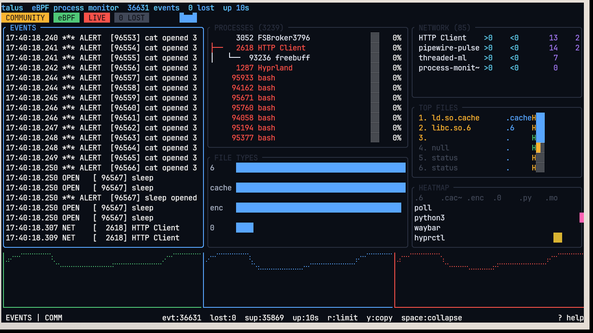
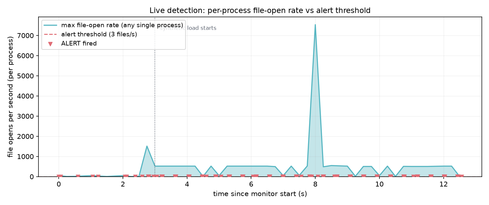
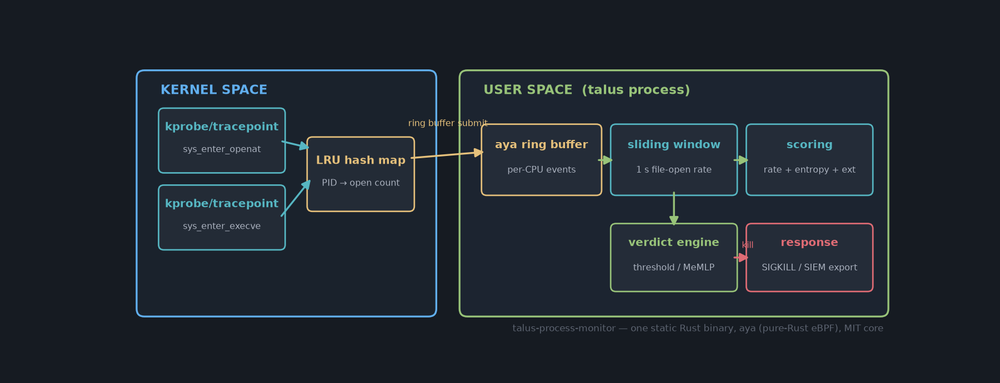

# Kernel-level ransomware detection in Rust: a sliding-window heuristic over eBPF syscalls

*How a small eBPF program, one LRU map, and a 1-second sliding window in Rust catch ransomware behaviour before encryption completes — with real throughput numbers from a working MIT-licensed implementation.*


*Talus TUI running live: the event stream shows per-second OPEN events and ALERT lines; the right panel ranks processes by open rate and alert count.*

---

Ransomware works in a simple way: it opens your files, encrypts them, and writes them back. Fast. A single process touching hundreds of files within seconds is not normal behaviour — it is the signature of an encryption routine at work.

You do not need a large model to spot this. You need to watch one number: **how many files a single process opens per second** — and you need to watch it where it cannot hide: in the kernel.

This article walks through the full detection pipeline of [Talus](https://github.com/BartoszOsiej/talus-process-monitor), an MIT-licensed eBPF monitor written in Rust: the kernel-side probes, the per-CPU event transport, the sliding-window heuristic, and the response path. All code shown is from the working implementation.

## 1. Why the kernel, why eBPF

A userspace agent can be evaded: a process can hide its own file access by calling open through indirect paths, or simply kill the agent watching it. Syscall tracing from the kernel sees every `openat` call regardless of what the process thinks it is doing.

eBPF is the right tool because it gives kernel-level visibility **without writing a kernel module**:

- Programs are verified by the kernel before loading — no crashes, no panics.
- Tracepoints on `sys_enter_openat` and `sys_enter_execve` fire for every process on the system, namespace-wide.
- Data crosses to userspace cheaply through per-CPU ring buffers, without a single context switch per event.

The alternative — parsing auditd logs or watching `/proc` in a polling loop — either costs a fortune in CPU or loses events under load. eBPF has neither problem.

## 2. The kernel side: two tracepoints and one map

Both the kernel program and the userspace loader must agree on the event layout, so it lives in a shared header with `#[repr(C)]`:

```rust
#[repr(C)]
pub struct FileEvent {
    pub pid: u32,
    pub uid: u32,
    pub fd: i32,
    pub timestamp: u64,
    pub comm: [u8; 16],   // process name (TASK_COMM_LEN)
    pub filename: [u8; 255],
}
```

The detection kernel program is deliberately small. On every `openat`, it looks up the calling PID in an LRU hash map and bumps a counter:

```rust
#[map]
static mut OPEN_COUNT: LruHashMap<u32, u32> =
    LruHashMap::with_max_entries(8192, 0);

#[tracepoint(name = "sys_enter_openat")]
pub fn trace_openat(ctx: TracepointContext) -> u32 {
    let pid = ctx.get_current_pid().as_bpf_ref().unwrap().id >> 32;
    let count = unsafe {
        match OPEN_COUNT.get_ptr_mut(&pid) {
            Some(c) => &mut *c,
            None => {
                OPEN_COUNT.insert(&pid, &1, 0).unwrap();
                return 0;
            }
        }
    };
    *count += 1;
    0
}
```

The LRU eviction is the whole trick: we never clean up PIDs of dead processes ourselves. The map stays bounded at 8192 entries, and the kernel evicts the least recently used — which is almost always a process that exited long ago. No allocator, no garbage collection, no leak.

Every event is then pushed to userspace through a per-CPU ring buffer — lock-free, allocation-free, and safe to call from a tracepoint context.

## 3. The userspace side: sliding window and scoring

The Rust loader (using [aya](https://aya-rs.dev), a pure-Rust eBPF library — no libbpf, no C toolchain in the build) consumes events and computes the heuristic:


*Live capture: per-process file-open rate during a synthetic ransomware simulation. The load generator produces bursts of 25 file touches every 0.4 s; the monitor fires 676 alerts during the run and one burst peaks at 7,500+ opens/s.*

The heuristic has three signals, evaluated per process:

**1. File-open rate in a sliding 1-second window.** A `HashMap<Pid, VecDeque<Timestamp>>` records open timestamps; when the queue length crosses the threshold (default 50, configurable down to 3 for testing), the process is flagged. The window slides — old timestamps are evicted from the front — so a slow-but-steady legitimate process never trips it.

**2. Filename entropy.** Ransomware renames files with random suffixes. Shannon entropy on the filename characters separates `report-final-v2.docx` (≈3.2 bits/char) from `a7f3e91c2b8d.docx.enc` (≈4.7 bits/char). It costs a single pass over the name.

**3. Extension tracking.** Mass writes to `.enc`, `.locked`, `.crypt` and similar extensions within the window are a near-certain signature, regardless of rate.

The three signals feed a small verdict engine. For the community edition it is a threshold rule on the combined score; an optional built-in module (`--memlp`) trains a tiny online-learning neural model (a few hundred parameters, no external dependencies) on live events to separate *benign / suspicious / ransomware* without any cloud round-trip.

## 4. Response: from alert to SIGKILL

Detection without response leaves you reading an alert about files that are already encrypted. Talus's response mode is one syscall away:

```rust
// the offending process is still mid-loop — SIGKILL is not catchable
#[cfg(feature = "auto-kill")]
fn kill_offender(pid: u32) -> io::Result<()> {
    // signal hook: fire-and-forget, kernel does the rest
    let res = unsafe { libc::kill(pid as i32, libc::SIGKILL) };
    if res == 0 { Ok(()) } else { Err(io::Error::last_os_error()) }
}
```

`SIGKILL` cannot be caught, blocked, or handled — the encryption loop dies mid-file. This is the EDR-style behaviour, and it is deliberately gated behind a license feature because auto-killing the wrong process (say, a backup job) is worse than not killing anything. That is also why the threshold is configurable down to a per-process level, and why the entropy and extension signals exist — rate alone would fire on a `git gc` or a mail indexer.

## 5. What it costs: overhead numbers

A monitor you cannot afford to run everywhere is a monitor you will not run anywhere. Talus's whole design targets a small constant overhead:

| Metric | Value | Notes |
|---|---|---|
| Delivered event throughput | **~280,000 events/s** sustained | per-CPU ring buffers, 5 s benchmark |
| Peak throughput | **290,000 events/s** | single-core delivery to userspace |
| Kernel-side estimate | **~562,000 events/s** | delivered + dropped under saturation |
| Agent CPU (normal load) | **7.6% of one core** | live desktop with TUI + JSON output |
| Agent memory | **~0.1% of system RAM** | LRU-bounded maps, no unbounded state |
| Dropped events | configurable | perf buffer size, back-pressure aware |

The benchmark above is a **synthetic worst case**: a deliberate I/O storm designed to saturate the ring buffers (you can see the drop counter climb — the kernel-side estimate accounts for it). Under normal system load the agent sits near idle, because a quiet desktop produces a few hundred events per second, not hundreds of thousands.


*The full pipeline: two kernel tracepoints feed an LRU map and a per-CPU ring buffer; the userspace process runs the sliding window, scoring, verdict, and response path. One static Rust binary, no external services.*

## 6. What it does not do

An honest security article should list failure modes:

- **False positives are real.** Backup tools, `git gc`, file indexers, and `find /` all open many files quickly. That is why the threshold is configurable per deployment, why entropy and extension signals exist, and why auto-kill is opt-in rather than default.
- **It is not antivirus.** Talus catches behavioural bursts, not known signatures or userland malware that hides its behaviour below threshold.
- **Kernel 5.8+ is required** (BTF and modern ring buffers), and loading needs root or `CAP_BPF` + `CAP_SYS_ADMIN`.
- **Rootkits that patch syscalls below eBPF are out of scope** — that is a job for a different layer entirely.

## 7. Summary

- Ransomware has a cheap, reliable kernel-level signature: per-process file-open rate.
- eBPF gives you that signal without kernel modules, without polluting audit logs, and without being killable by the process it watches.
- A 1-second sliding window, filename entropy, and extension tracking together produce a low-false-positive verdict — and `SIGKILL` turns the monitor into an active response agent.
- Sustained throughput of ~280k events/s with 7.6% CPU on a live desktop means the agent is cheap enough to run everywhere.

The project is MIT-licensed and lives at [github.com/BartoszOsiej/talus-process-monitor](https://github.com/BartoszOsiej/talus-process-monitor). The longer technical write-up on the detection pipeline is on [DEV.to](https://dev.to/bartoszosiej/detecting-ransomware-with-ebpf-in-rust-4779); the project documentation and TUI screenshots are at the [project site](https://bartoszosiej.github.io/talus-process-monitor/).

*Bartosz Osiej is a Rust and eBPF developer and the maintainer of talus-process-monitor.*
